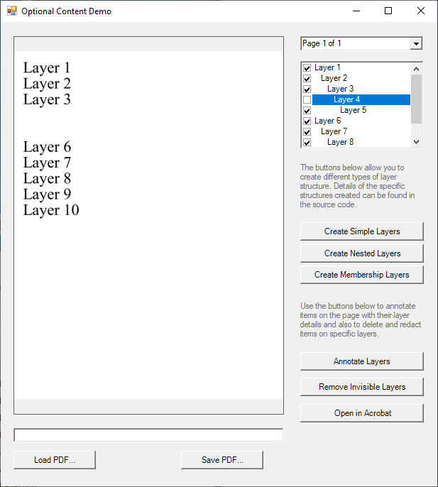

<h1>PDF OGC Layers</h1>
<h2>.NET Windows Forms project demonstrating how to create and set visibility for PDF layers - Optional Content Groups - OCGs.</h2>

This code sample shows how to:

<ul>
<li>Create simple layers</li>
<li>Create nested layers</li>
<li>Create membership layers</li>
<li>Load a PDF containing layers</li>
<li>Annotate the layers that exist</li>
<li>Redact or delete layers that are invisible</li>
<li>Save the final PDF</li>
</ul>

In the screenshot below you can see found nested layers with the layer visibility for 'Layer 4' set to off. This implicitly sets the visibility of 'Layer 5' to off because it is nested. The checkboxes on the right allow you to view the OCG structure and set OCG visibility.

<em>The ABCpdf Team</em>

